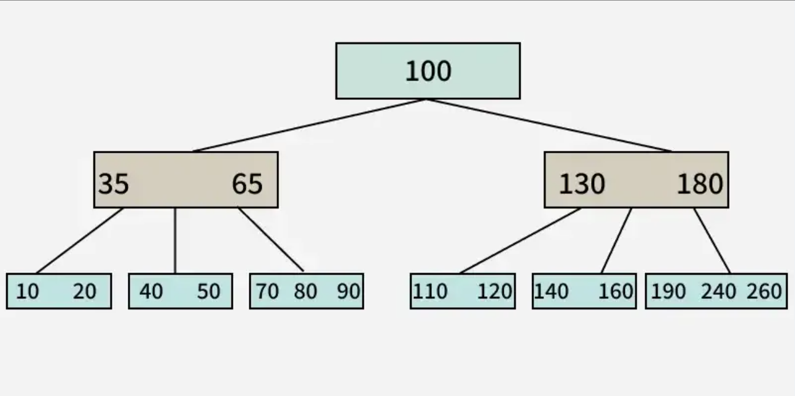
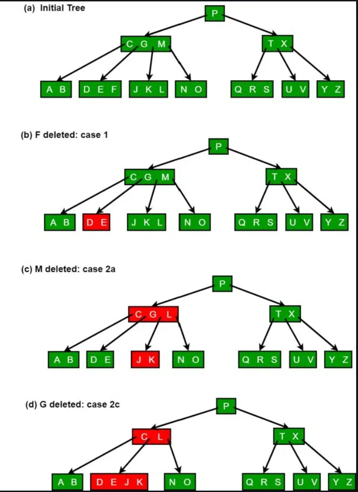

# B-Tree

- The core premise of the B-tree is that it is kind of a search tree that has an order (max number of keys in a node) > 2 allowing for a lower tree height

- The reason a lower height is important is becuase pulling a node from memory is usually the most expensive instruction in tree traversal

- B-trees spend more time on each node comparing keys and less time pulling nodes from memory

## Definition

A B Tree of order m can be defined as an m-way search tree which satisfies the following properties:

1. All leaf nodes of a B tree are at the same level, i.e. they have the same depth (height of the tree).
2. The keys of each node of a B tree (in case of multiple keys), should be stored in the ascending order.
3. In a B tree, all non-leaf nodes (except root node) should have at least m/2 children.
4. All nodes (except root node) should have at least m/2 - 1 keys.
5. If the root node is a leaf node (only node in the tree), then it will have no children and will have at least one key. If the root node is a non-leaf node, then it will have at least 2 children and at least one key.
6. A non-leaf node with n-1 key values should have n non NULL children.

## 

## Other notes

- A B-tree must always obey the above definiton and be a search tree, so when inserting and deleting from a B-tree a special algorithm is used to insure that the B-tree still is correct

- This algorithm is complicated, geeks for geeks's exampile is >600 lines long, but it is still usualy worth it computationally over normal binary search trees 

## 

#### References

- https://www.geeksforgeeks.org/introduction-of-b-tree-2/

- https://www.youtube.com/watch?v=K1a2Bk8NrYQ

 